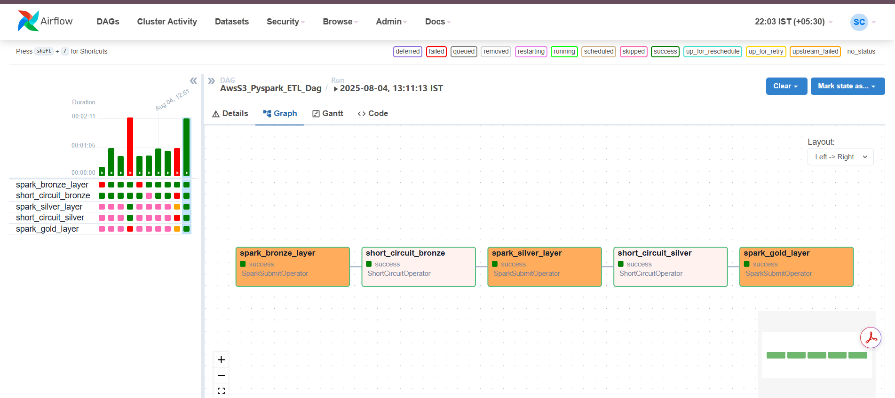

# AwsS3_Pyspark_ETL_Dag

AwsS3_Pyspark_ETL_Dag is an Apache Airflow DAG that orchestrates a multi-stage ETL pipeline using PySpark, processing data from AWS S3 in Bronze, Silver, and Gold layers. Each stage is managed by a dedicated PySpark script, and the pipeline uses ShortCircuitOperators to ensure robust, conditional task execution.

## Features

- Layered ETL (Bronze, Silver, Gold)
- S3 integration via hadoop-aws and aws-java-sdk-bundle
- Task orchestration with Airflow and SparkSubmitOperator
- Conditional execution and failure handling

## Technologies

- Apache Airflow
- PySpark
- AWS S3

## Usage

1. Configure your AWS credentials and S3 bucket.
2. Place your PySpark scripts in the project directory.
3. Deploy the DAG to your Airflow instance.
4. Trigger the DAG from the Airflow UI.

## Snippet Of the Dag from Airflow Webserver UI
